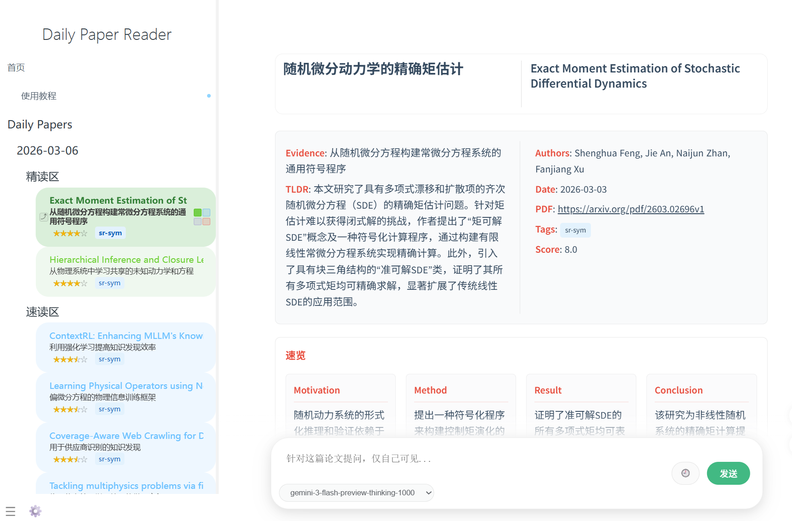
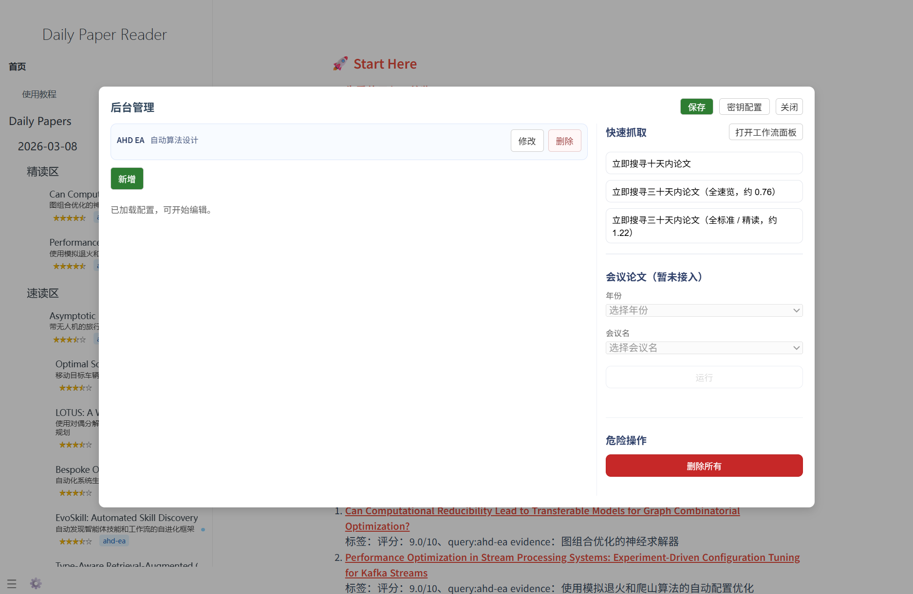

# Research Radar

Research Radar is a local-first academic discovery workspace built on top of Daily Paper Reader. It helps you create a research field, expand it with a local Ollama model, collect papers from OpenAlex, and inspect papers, authors, institutions, venues, and collaboration networks in one browser UI.

The current public version is designed for personal researchers, PhD students, and small labs who want a private paper radar without sending their research interests or local notes to a hosted application.



## What It Does

- Create a **Research Field** from your own topic, such as `Incomplete Multimodal Recommendation`.
- Use a local **Ollama** model, defaulting to `qwen3:8b`, to expand the field into search keywords and intent queries.
- Fetch real paper metadata from **OpenAlex**.
- Store your research library locally in **SQLite**.
- Browse accepted papers, authors, institutions, venues, and scholar collaboration graphs.
- Keep Daily Paper Reader's existing paper-reading workflow available in the same project.

## Why Local Ollama

Research Radar is intentionally local-first. The recommended setup uses Ollama on your own machine:

- Your research field text stays on your computer.
- You do not need a cloud LLM API key for field planning.
- You can switch the local model when Ollama supports it.
- The default model is `qwen3:8b`, which works well for planning academic search queries.

Supabase support still exists for development and cloud experiments, but the default Research Radar workflow does not require Supabase, PostgreSQL, Docker, SQL Editor, or service-role keys.

## Quick Start

### 1. Install Ollama

Install Ollama from:

```text
https://ollama.com/
```

Then pull the recommended local model:

```bash
ollama pull qwen3:8b
```

Make sure Ollama is running:

```bash
ollama list
```

### 2. Install Research Radar

Use Python 3.11 or newer.

```bash
git clone https://github.com/Wmhwxl/research-radar.git
cd research-radar
python -m venv .venv
.\.venv\Scripts\activate
pip install -e .
```

On macOS or Linux, activate the environment with:

```bash
source .venv/bin/activate
```

### 3. Start The Local App

```bash
research-radar init
research-radar start
```

The app opens at:

```text
http://127.0.0.1:8765/#/research-radar/
```

When you create a new Research Field, Research Radar can ask local Ollama to generate a better search plan, then start collecting papers from OpenAlex.

## Common Commands

```bash
research-radar doctor
research-radar sync --field <field-slug> --years 1 --max-pages 1
research-radar version
```

`doctor` checks the local runtime, database migrations, SQLite FTS support, write permission, frontend files, and OpenAlex connectivity.

`sync` runs a small paper collection job for an existing field. Start with `--years 1 --max-pages 1` before trying larger jobs.

## Configuration

The first run creates a local config file in your system application-data directory. You can also set a portable data directory:

```bash
set RESEARCH_RADAR_HOME=E:\research-radar-data
```

macOS/Linux:

```bash
export RESEARCH_RADAR_HOME=~/research-radar-data
```

Useful environment variables:

```text
RESEARCH_RADAR_PORT=8765
RESEARCH_RADAR_OLLAMA_ENABLED=true
RESEARCH_RADAR_OLLAMA_URL=http://127.0.0.1:11434
RESEARCH_RADAR_OLLAMA_MODEL=qwen3:8b
OPENALEX_API_KEY=
```

OpenAlex works without an API key for light personal usage. If you have one, add it to the local config or environment.

## Local Data And Privacy

By default, Research Radar stores data in a local SQLite database under your user application-data directory. The repository ignores `.env`, local databases, logs, caches, virtual environments, generated archives, and Codex working files.

Do not commit real API keys or private research data.

## Development

Install the project in editable mode:

```bash
pip install -e .
```

Run the Research Radar test suite:

```bash
pytest tests/test_research_radar_*.py
node tests/test_research_radar_frontend.js
```

Run JavaScript syntax checks when changing frontend files:

```bash
node --check app/research-radar.js
node --check app/research-radar-api.js
node --check app/research-radar-state.js
node --check app/research-radar-overview.js
node --check app/research-radar-papers.js
node --check app/research-radar-authors.js
node --check app/research-radar-graph.js
node --check app/research-radar-detail-panel.js
```

## Project Structure

```text
app/                         Browser UI
src/research_radar/          Research Radar backend, CLI, storage, sync logic
src/providers/               OpenAlex provider
src/maintain/                Daily Paper Reader maintenance scripts
sql/                         Optional Supabase SQL migrations and RPC files
tests/                       Python and JavaScript tests
docs/                        Docsify content
fixtures/research_radar/     UI fixture data
```

## Screenshots

<p align="center">
  
</p>
<p align="center">
  
  
</p>

## Relationship To Daily Paper Reader

This repository started from the Daily Paper Reader codebase and keeps its paper reading, Docsify UI, Zotero-related helpers, GitHub Pages workflow, and conference-paper tooling. Research Radar is added as a local-first research-field workspace on top of that foundation.

Daily Paper Reader's original idea is still valuable: it gives researchers a personal paper homepage and a daily reading flow. Research Radar extends that idea from "daily paper feed" to "field-level academic map".

## Roadmap

- Better one-click packaged desktop startup.
- Richer local model choices through Ollama.
- More transparent field planning controls.
- Better import/export for personal research libraries.
- Optional cloud sync for users who explicitly want it.

## License

This project keeps the upstream license in `LICENSE`. If you build on it, preserve attribution and follow the license terms.

## A Note For WeChat Readers

If you saw this from our WeChat public account: the recommended path is simple.

1. Install Ollama.
2. Pull `qwen3:8b`.
3. Start Research Radar locally.
4. Create your own Research Field.
5. Let it collect and organize papers for your topic.

No hosted account is required for the default local workflow.
